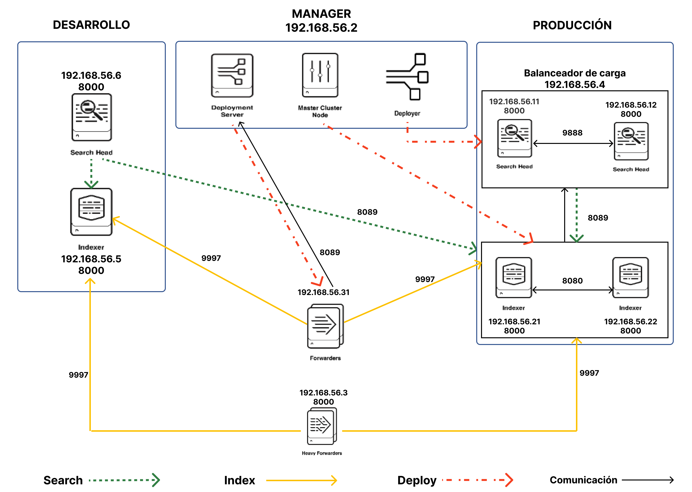

# Splunk Distributed Architecture Vagrant

## Tabla de contenidos

- [Splunk Distributed Architecture Vagrant](#splunk-distributed-architecture-vagrant)
  - [Tabla de contenidos](#tabla-de-contenidos)
  - [Requisitos](#requisitos)
  - [🔑 Credenciales](#-credenciales)
  - [Primer uso](#primer-uso)
  - [Uso](#uso)
    - [Tu primera vez levantando un componente de la infraestructura 🚀](#tu-primera-vez-levantando-un-componente-de-la-infraestructura-)
  - [Especificaciones técnicas por defecto de la infraestructura](#especificaciones-técnicas-por-defecto-de-la-infraestructura)
    - [Componentes](#componentes)
    - [Vagranfiles](#vagranfiles)
    - [Archivos de configuración](#archivos-de-configuración)

## Requisitos

- Tener instalado VirtualBox con una versión igual o superior a la 7.
- Tener instalado Python 3.
- Tener instalado Vagrant con una versión igual o superior a la 2.4.1.

## 🔑 Credenciales

Las credenciales del usuario de instalación de Splunk son las siguientes:

- username: admin
- password: admin1234

## Primer uso

- Instalar las dependencias de Python:

  ```bash
  pip install -r requirements.txt
  ```

  Se recomienda usar virtualenv para gestionar las dependencias de forma que no colisionen con otras versiones instaladas para otros proyectos. Para saber mas visitar la documentación <https://virtualenv.pypa.io/en/latest/>.

- Configurar las imagen base para todas las maquinas virtuales del repositorio de imágenes base de Vagrant:

  ```bash
  python cli.py config-base-image -i <imagen_base>
  ```

- Descargar los comprimidos TGZ para Universal Forwarder y Splunk Enterprise con la version que queramos. Situar estos TGZ en el directorio `common/downloads/` con los siguientes nombres:
  - Para el Universal Forwarder el TGZ se debe llamar `universalforwarder.tgz`.
  - Para el Splunk Enterprise el TGZ se debe llamar `splunk-enterprise.tgz`.

  En la carpeta `common/downloads/` podemos guardar TGZ de otras versiones de los productos de Splunk pero solo serán los que se llamen `universalforwarder.tgz` y `splunk-enterprise.tgz`los que el Vagrantfile utilizara para levantar la arquitectura.

## Uso

Para gestionar la infraestructura se utilizara el script de Python cli.py. Para obtener información de las cosas que podemos hacer con este script deberemos ejecutar lo siguiente:

```bash
python cli.py --help
```

Si queremos saber mas información sobre un comando en concreto ejecutaremos lo siguiente:

```bash
python cli.py <comando> --help
```

También se puede usar con los comandos de Vagrant directamente. Para saber mas visitar <https://developer.hashicorp.com/vagrant/tutorials/getting-started/getting-started-up>. Para saber mas sobre los Vagrantfiles que hay en cada carpeta del repo ir a [Vagranfiles](#vagranfiles).

### Tu primera vez levantando un componente de la infraestructura 🚀

```bash
python cli.py manage --action=start core_de
```

### Comandos

#### manage

Este comando sirve para manejar el estado de las componentes de la arquitectura. Con este comando podemos pararlos, levantarlos o destruirlos.

Para obtener mas información ejecutar:

```bash
python manage --help
```

#### info

Este comando sirve para obtener información de ayuda. Las opciones que tenemos son las siguientes:

- vms: Nos da información sobre las maquina virtuales que componen toda la infraestructura.

Para obtener mas información ejecutar:

```bash
python info --help
```

#### config-base-image

Este comando sirve para configurar la imagen base de Vagrant que van a utilizar todas las maquinas virtuales de la infraestructura.

Para obtener mas información ejecutar:

```bash
python config-base-image --help
```

#### connect

Este comando sirve para conectarnos a las maquinas virtuales por SSH.

Para obtener mas información ejecutar:

```bash
python connect --help
```

#### config-instances

Este comando sirve para configurar cuantas instancias queremos de los siguientes componentes:

- Forwarders
- Indexadores
- Search heads.

Para obtener mas información ejecutar:

```bash
python config-instances --help
```

## Especificaciones técnicas por defecto de la infraestructura



### Componentes

- core_pr: Incluye los indexadores de producción, search heads de producción y el manager.
- core_de: Incluye el indexador de desarrollo y el search head de desarrollo.
- lb: Incluye el balanceador de carga para los search heads de producción.
- fwd: Incluye los forwarders.
- hf: Incluye el Heavy Forwarder.

### Vagranfiles

- `s14e/Vagrantfile`: Vagrantfile para crear las siguientes maquinas:
  - Indexadores de producción
  - Search heads de producción
  - Manager
  - Indexador de desarrollo
  - Search head de desarrollo
  - Heavy Forwarder
- `l10r/Vagrantfile`: Vagrantfile que crea el balanceador de carga para los search heads de producción.
- `u16f/Vagrantfile`: Vagrantfile que crea los forwarders.

### Archivos de configuración

- `config.json`: Archivo que contiene toda la parametrización de la arquitectura. Se puede usar para modificar los parámetros de la arquitectura como el numero de indexadores de producción. También las IP's asignadas a las maquinas virtuales que se crean. Este archivo consta de un objeto raíz y varios sub-objetos que representan cada componente de la infraestructura. Dentro de cada componente encontramos una array IP's. Si hay 5 IP's se crearan cinco maquina virtuales para ese componente, cada una con una IP del array.
